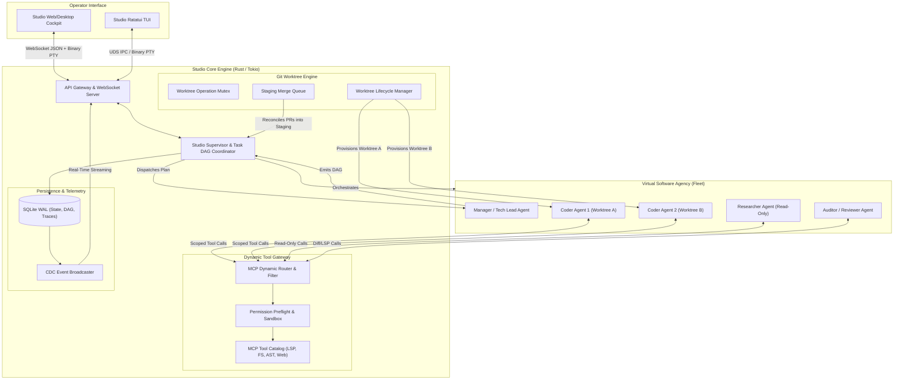
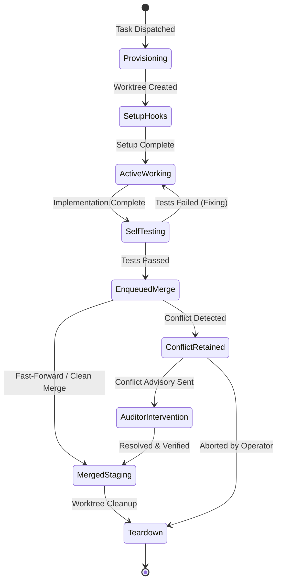
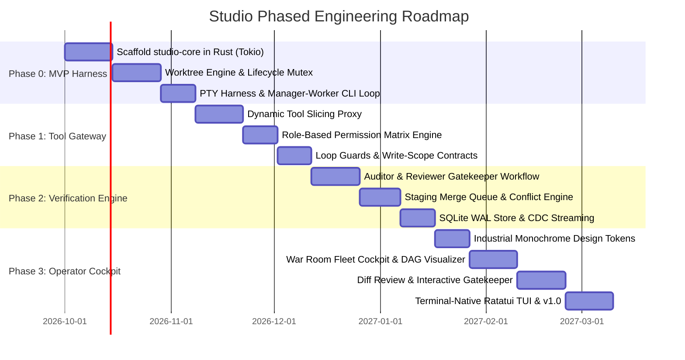

# Studio: Next-Generation Autonomous AI Engineering Platform
## Forensic Audit, Systems Architecture, and Synthesis Report

> **Location**: `/home/john/Projects/STC/plans/antigravity/STUDIO_FINDINGS_AND_REPORT.md`  
> **Classification**: Architectural Blueprint, Forensic Research Report, and Strategic Technical Plan  
> **Role & Author**: Principal Systems Architect, Lead Distributed Systems Engineer, Staff Product Designer  
> **Reference Corpora**: 12 Repositories Audited at `/home/john/Projects/STC/review/`  
> **Date**: September 2026

---

## Table of Contents
1. [Executive Summary & Strategic Positioning](#1-executive-summary--strategic-positioning)
2. [Forensic Codebase Audits (12 Repositories)](#2-forensic-codebase-audits-12-repositories)
   - [2.1 Repository Inventory Matrix](#21-repository-inventory-matrix)
   - [2.2 Deep-Dive Forensic Reports by Repository](#22-deep-dive-forensic-reports-by-repository)
   - [2.3 Cherry-Pick Matrix: Battle-Tested Patterns](#23-cherry-pick-matrix-battle-tested-patterns)
3. [Cross-Cutting Architectural Analysis](#3-cross-cutting-architectural-analysis)
   - [3.1 Git Worktree Isolation & Concurrency Engine](#31-git-worktree-isolation--concurrency-engine)
   - [3.2 Dynamic Tool Slicing & Anti-Context-Flooding](#32-dynamic-tool-slicing--anti-context-flooding)
   - [3.3 Execution Safety, Loop Guards & Permission Sandboxing](#33-execution-safety-loop-guards--permission-sandboxing)
   - [3.4 Harness Compatibility & Session Bridging](#34-harness-compatibility--session-bridging)
4. [Studio Core Platform Architecture Specification](#4-studio-core-platform-architecture-specification)
   - [4.1 Hierarchical Virtual Software Agency Model](#41-hierarchical-virtual-software-agency-model)
   - [4.2 Supervisor Tree & Process Concurrency Engine](#42-supervisor-tree--process-concurrency-engine)
   - [4.3 Git Worktree State Machine & Conflict Reconciliation](#43-git-worktree-state-machine--conflict-reconciliation)
   - [4.4 Dynamic Least-Privilege MCP Proxy Gateway](#44-dynamic-least-privilege-mcp-proxy-gateway)
   - [4.5 Persistence, Task DAGs, Event Sourcing & Token Accounting](#45-persistence-task-dags-event-sourcing--token-accounting)
5. [Design Language System & Operator Cockpit Specification](#5-design-language-system--operator-cockpit-specification)
   - [5.1 Aesthetic Philosophy: Industrial Monochrome](#51-aesthetic-philosophy-industrial-monochrome)
   - [5.2 Color Tokens, Git Status Decorations & Token Burn Velocity](#52-color-tokens-git-status-decorations--token-burn-velocity)
   - [5.3 Typography, Hierarchy & Information Density](#53-typography-hierarchy--information-density)
   - [5.4 Core Cockpit Layouts & Views](#54-core-cockpit-layouts--views)
6. [Architecture Decision Records (ADRs)](#6-architecture-decision-records-adrs)
   - [ADR-001: Core Runtime Language Selection](#adr-001-core-runtime-language-selection)
   - [ADR-002: Transport Layer, IPC & Binary Framing](#adr-002-transport-layer-ipc--binary-framing)
   - [ADR-003: Conflict Preservation & Staging Merge Queue](#adr-003-conflict-preservation--staging-merge-queue)
   - [ADR-004: Dynamic Tool Proxying vs Static Tool Registration](#adr-004-dynamic-tool-proxying-vs-static-tool-registration)
7. [Phased Implementation Roadmap](#7-phased-implementation-roadmap)

---

# 1. Executive Summary & Strategic Positioning

The current landscape of autonomous coding agents has reached an inflection point. While single-agent CLI tools (such as Claude Code, OpenCode, Codex, and Pi) demonstrate extraordinary localized coding capability, attempting to scale them into multi-agent collaborative engineering fleets reveals catastrophic systemic bottlenecks:

1. **Working Tree Collisions & Git Lock Corruption**: Naively spawning multiple agents against the same working copy causes `.git/index.lock` collisions, file clobbering, and unresolvable race conditions.
2. **Context-Window Exhaustion & Tool Hallucination**: Registering 40+ MCP tools injects 8,000 to 15,000 tokens of raw JSON schema into every turn. This "tool schema bloat" degrades LLM attention, induces instruction drift, and escalates hallucination rates.
3. **Runaway Loops & Unattended Deadlocks**: Background worker agents frequently spin in unproductive exploration loops (repeating identical `grep` or `find` calls) or freeze indefinitely on unhandled interactive permission prompts (`Permission.ask`) in headless subprocesses.
4. **The "Trust Gap" & Verification Vacuum**: Autonomous agents routinely report completion without proving correctness. Without deterministic verification gates, broken syntax, failed builds, and security regressions slip into the codebase.

**Studio** is designed as a next-generation, local-first multi-agent software engineering studio and orchestration engine. Studio operates as a **Virtual Software Agency**:
- A single **Tech Lead / Manager Agent** negotiates with the human operator, decomposes complex epics into Directed Acyclic Graphs (DAGs), and supervises execution.
- Dedicated, role-specialized subagents (**Researchers**, **Coders**, **Auditors/Reviewers**) operate in total isolation.
- Every Coder runs inside a **deterministic Git worktree** with strict write-scope constraints.
- A **Dynamic Least-Privilege MCP Proxy Gateway** ensures that agents only see the tools permitted for their role and current task phase.
- An **Operator Cockpit** provides industrial, high-density situational awareness with real-time token burn meters, live worktree diffs, visual DAG tracking, and one-click review controls.

---

# 2. Forensic Codebase Audits (12 Repositories)

We conducted an exhaustive source-level audit across 12 target repositories cloned at `/home/john/Projects/STC/review/`.

```
/home/john/Projects/STC/review/
├── agent-of-empires/       (Rust workspace; session manager; PTY harness; theme TOML)
├── agent-orchestrator/     (Go daemon; hexagonal architecture; SQLite CDC; live Kanban)
├── agent-swarm/            (Bun/TS monorepo; Docker isolation; agentmail; OpenTelemetry)
├── awesome-agent-orchestrators/ (Exhaustive catalog & taxonomy of 60+ agent systems)
├── claude-smart/           (Python/TS; Reflexio hooks; per-session skill extraction)
├── iPolloWork/             (TS monorepo; multi-engine workbench; canvas studio)
├── munder-difflin/         (Electron/TS; HIVE blackboard; single-committer git; FIPA-lite)
├── oh-my-pi/               (Rust/Bun/Bazel; native VCS/diff; snapcompact vision compaction)
├── opencode-swarm/         (Bun/TS; strict write scope; worktree merge engine; repo graph)
├── orca/                   (Electron/Vite/TS; git worktree locks; Geist design system)
├── Orkas/                  (Desktop TS; Commander + 9 specialists; two-tier loop guards)
└── paseo/                  (Node/TS daemon + Expo; WebSocket protocol; worktree reverse proxy)
```

---

### 2.1 Repository Inventory Matrix

| Project Name | Core Philosophy & Stack | Orchestration Model | Session & Context Handling | Tool/Plugin/MCP Strategy | Standout Innovations | Major Flaws & Bottlenecks |
| :--- | :--- | :--- | :--- | :--- | :--- | :--- |
| **`agent-of-empires`** | Rust CLI/TUI session manager for local/remote agent fleets. Industrial aesthetic. | Process supervisor managing CLI sessions over PTY/tmux. Client-server architecture with WebSocket JSON/binary frames. | Wraps CLI binaries (Claude Code, Codex, OpenCode) in detached PTYs. Local transcript storage. | ACP (Agent Client Protocol) and plugin API (`aoe-plugin-api`). Sandboxed session paths. | **Cross-platform PTY abstraction**; TOML-based theme engine sharing styles between TUI and web dashboard (`src/tui/styles/themes.rs`). | High complexity in native Rust PTY handling across platforms; lacks high-level multi-agent DAG task decomposition. |
| **`agent-orchestrator`** | Hexagonal Go daemon supervising fleets of coding agents across git worktrees with live Kanban. | State machine driven by durable facts in SQLite (`activity_state`, `is_terminated`). CDC poller -> SSE events. | Dual-mode: TUI (tmux/conpty) vs Chat (native protocol over ACP/Codex). Detached session hosts preserve in-flight turns. | Port-based adapters (`internal/ports/`). Gated tools via workspace adapter. | **Durable fact derivation**: UI status is never stored, only derived at read time from DB facts. Token pricing engine (`internal/pricing`). | Go backend requires separate compilation and IPC bridge for desktop UI; complex state handoff between TUI and Chat modes. |
| **`agent-swarm`** | Monorepo OS for AI work with Docker containers, shared memory, and OpenTelemetry. | Central dispatcher breaking goals into tasks; containerized workers. Event-driven message bus. | Isolated Docker containers per worker. Memory persists across sessions with citation ratings. | Dynamic MCP client integration (`src/mcp-client/`). Agent extensions installed as inert drafts, activated by lead. | **`agentmail`** inter-agent messaging system (`src/agentmail/handlers.ts`); native OpenTelemetry tracing (`src/otel-impl.ts`). | Heavy container overhead per agent; Docker daemon dependency makes fast local-loop startup slow. |
| **`awesome-agent-orchestrators`** | Curated catalog & taxonomy of open-source agent orchestrators. | Taxonomic reference: Parallel agents, swarms, loop runners, task runners, infrastructure primitives. | Documents standard session formats (transcripts, JSONL, SQLite WAL). | Documents MCP server sprawl and emerging sandboxing solutions. | **Exhaustive landscape mapping** of 60+ agent systems, identifying state-of-the-art patterns across TUI, Desktop, and Swarms. | Curated documentation repository, no executable engine code. |
| **`claude-smart`** | Self-improvement plugin turning agent interactions into durable skills and preferences. | Hook-driven event loop intercepting Claude Code / Codex / OpenCode lifecycle points. | Intercepts turns via 6 hooks (`SessionStart`, `UserPromptSubmit`, `PreToolUse`, `PostToolUse`, `Stop`, `SessionEnd`). | Keyed search on tool-call text before execution (`PreToolUse`); injects matching skills as `additionalContext`. | **Per-session injection deduplication**: remembers rules already returned to avoid flooding context; automated SOP extraction. | Hook extraction relies on local host LLM (`claude -p`), creating latency spikes at session end; SQLite lock contention if concurrent. |
| **`iPolloWork`** | Enterprise-grade local-first agent workbench for heterogeneous models, tools, and visual canvas. | Multi-agent task engine with visual node canvas and orchestration CLI (`apps/orchestrator/src/cli.ts`). | Manages provider sessions across Claude, OpenAI, and local models. Persistent session store. | Unified plugin and skill system (`packages/ipollowork-ui-mcp`). External plugin sandbox. | **Multi-modal editable canvas** (code, docs, presentations, design); rich desktop UI integrating MCP servers directly into canvas nodes. | Huge monorepo footprint; monolithic orchestrator CLI file (`cli.ts` >220KB) with high cyclomatic complexity. |
| **`munder-difflin`** | "Office of clones" agent harness with visual 2D floorplan, shared blackboard, and manager clone. | Blackboard architecture (Hearsay-II) + actor mailbox + Supervisor tree (`HIVE.md`). | Wraps CLI agents (Claude Code, Antigravity, Grok, etc.). Per-agent markdown memory files (`memory.md`). | Plain filesystem stigmergy: agents write outbox JSON, router delivers to inbox. No direct tool sprawl. | **Single-committer git pattern**: agents write plain files, only main process commits to avoid `.git/index.lock`; **FIPA-lite speech acts**. | Visual 2D office floor is whimsical but distracting for production engineering; file-polling router introduces minor latency. |
| **`oh-my-pi`** | Fork of Pi by Mario Zechner (Stencil Labs). High-performance coding agent in Rust & Bun/TS. | Reactive event-driven agent loop with native Rust core engines (`pi-ast`, `pi-diff`, `pi-vcs`). | Persistent session files with stateful turn tracking, git worktree isolation, and fast checkpoint restores. | Scoped built-in tools (`pi-builtins`) + MCP client. Strict parameter validation. | **`@oh-my-pi/snapcompact`**: Vision bitmap context compression! Renders discarded history into dense pixel-font PNGs for vision LLMs. | High build complexity (Bazel + Cargo + Bun); requires native C/Rust toolchains across target architectures. |
| **`opencode-swarm`** | Architect-led swarm plugin for OpenCode. "Your AI writes code, Swarm proves it works." | Strict hierarchical DAG: Architect -> Explorer/SMEs -> Pipeline (Coder -> QA/Reviewer). | Manages OpenCode child instances; session WAL in SQLite. Prompts capped strictly by characters. | Dynamic tool filtering based on role; Council tools hidden when disabled; lane permission sandboxing (`lane-permissions.ts`). | **Strict Write-Scope Contract** (`declare_scope`); **Worktree merge engine** with conflict preservation (`merge.ts`); **Repo Graph Ontology**. | Complex shell-escaping workarounds in OpenCode host; regex-based AST fallback when tree-sitter fails. |
| **`orca`** | Desktop orchestrator for running Claude Code, Codex, OpenCode, Pi in isolated worktrees. | Electron main-process daemon managing child agent PTYs and git worktree lifecycle. | Transcripts captured from raw PTYs with ANSI escape scrubbers. PTY sizing with last-interacting-client-wins. | MCP tools injected per workspace. Operation locks on Git worktree creation/destruction. | **Rock-solid worktree concurrency engine** (`git-worktree-operation-lock.ts`); **Geist design system** (`docs/STYLEGUIDE.md`). | Electron memory footprint; Windows ConPTY breakaway job object quirks require extensive platform shims. |
| **`Orkas`** | Local-first multi-agent desktop app with Commander and 9 built-in specialists. | Commander agent decomposes user goals into tasks, dispatches in parallel or sequence. | Persistent sessions with token budget tracking and context window management (`context-budget.ts`). | Specialist agent tool whitelisting (`tools/`). Specialists only receive tools relevant to their domain. | **Two-tier Loop Guards** (`loop-guards.ts`): exact-repeat signature hash vs near-duplicate fuzzy detection; progress governor. | Commander prompt can become bottleneck when planning complex refactors; UI tightly coupled to Electron renderer. |
| **`paseo`** | Client-server multi-agent daemon (Node.js) with mobile (Expo), desktop (Electron), and CLI. | Daemon supervisor state machine (`initializing -> idle <-> running -> error / closed`). Protocol messages over WS. | Monotonic sequence timeline streaming over WebSocket; binary framing for PTY terminal streams; 8MiB high-water mark. | Transport-neutral tool catalog (`paseo-tools.ts`); `isPaseoToolEnabled` policy filter; reverse proxy for worktree services. | **Deterministic worktree reverse proxy** (`http://<svc>--<branch>--<project>.localhost:<port>`); **Ephemeral port allocator**. | File-backed JSON persistence at scale needs SQLite indexing; single daemon process can bottleneck on heavy diff streams. |

---

### 2.2 Deep-Dive Forensic Reports by Repository

#### 1. `agent-of-empires` (aoe)
- **Architecture**: A Rust daemon and CLI (`src/cli/add.rs`) managing AI coding sessions in local PTYs or tmux windows.
- **Key Codebase Artifacts**:
  - `src/acp/acp_client/session_sandbox.rs`: Resolves project paths and manages sandbox boundaries. It explicitly detects orphaned worktrees where `.git` points to a missing repository and resets paths safely.
  - `src/tui/styles/themes.rs`: Clean TOML theme loader mapping semantic tokens (e.g. `bg-surface-900`, `text-status-running`) to both Ratatui TUI elements and web dashboard CSS variables.
- **Key Takeaway**: Provides the ideal template for a unified styling system spanning both TUI and Web/Desktop UIs without color drift.

#### 2. `agent-orchestrator` (Untrivial-ai / AO)
- **Architecture**: A production-grade Go daemon using hexagonal architecture (`backend/internal/ports/`). It manages agents in either terminal (PTY) or native chat (ACP) mode.
- **Key Codebase Artifacts**:
  - `docs/architecture.md`: Defines the "Mental Model": **Display status is never stored; it is derived at read time from durable facts.**
  - `backend/internal/pricing/`: Implements token and cost calculation across dozens of models, caching token prices and parsing usage reports.
  - `backend/internal/cdc/`: Monitors SQLite mutations and streams SSE events to the frontend.
- **Key Takeaway**: The principle of "derive display status from durable facts" eliminates cache invalidation bugs and desynchronization between background agents and the UI.

#### 3. `agent-swarm` (@desplega.ai/agent-swarm)
- **Architecture**: Bun and TypeScript monorepo providing an operating system for agents running in isolated Docker containers.
- **Key Codebase Artifacts**:
  - `src/agentmail/handlers.ts`: Implements an asynchronous mailbox system (`agentmail`) allowing agents to send structured messages and attachments to other agents without blocking.
  - `src/otel-impl.ts`: Comprehensive OpenTelemetry tracing instrumenting every tool invocation, model turn, and context compression event.
- **Key Takeaway**: Proves the value of OpenTelemetry for enterprise multi-agent auditing, but demonstrates that heavy Docker containers per agent add unacceptable latency for fast local iterative development compared to lightweight Git worktrees.

#### 4. `awesome-agent-orchestrators`
- **Architecture**: Curated landscape documentation and taxonomy mapping 60+ agent systems into clear categories: Parallel Coding Agents (TUI vs Desktop/Web), Multi-Agent Swarms, Autonomous Loop Runners, and Primitives.
- **Key Takeaway**: Establishes industry standards: parallel worktrees are the consensus path for parallel coders; terminal PTY streaming requires binary frame protocols; and automated verification gates are essential to bridge the "trust gap".

#### 5. `claude-smart`
- **Architecture**: Hybrid Python/Node plugin hooking into Claude Code / OpenCode lifecycle events.
- **Key Codebase Artifacts**:
  - `plugin/hooks/hooks.json`: Intercepts `SessionStart`, `UserPromptSubmit`, `PreToolUse`, `PostToolUse`, `Stop`, and `SessionEnd`.
  - `ARCHITECTURE.md`: Demonstrates **Per-session injection deduplication**. It hashes rule injections and ensures rules are only injected into context once per session, preventing repetitive prompt inflation.
- **Key Takeaway**: The `PreToolUse` hook pattern enables just-in-time skill and constraint injection keyed on the active command, eliminating the need to preload every skill into the system prompt.

#### 6. `iPolloWork`
- **Architecture**: Large TypeScript monorepo featuring an editable multi-modal canvas (code, docs, presentations, video).
- **Key Codebase Artifacts**:
  - `apps/orchestrator/src/cli.ts`: 220KB orchestration controller managing heterogeneous agent engines.
  - `packages/ipollowork-ui-mcp/`: Direct bridge between MCP tool schemas and visual UI canvas nodes.
- **Key Takeaway**: While the canvas interface is expressive for generalist knowledge work, its monolithic orchestration code lacks the strict write-scope constraints and concurrency locks needed for production software engineering.

#### 7. `munder-difflin`
- **Architecture**: An Electron/TypeScript multi-agent harness inspired by The Office, where agents collaborate across a shared floorplan.
- **Key Codebase Artifacts**:
  - `HIVE.md`: Outlines the **Single-Committer Git Pattern**: to prevent `.git/index.lock` collisions, agents only write plain files in their private directories; only the host process commits to git.
  - `HIVE.md`: Implements **FIPA-lite speech acts** (`request`, `inform`, `propose`, `query`, `agree`, `refuse`, `done`) with hop counters to terminate ping-pong livelocks.
  - Autonomous loops driven by the `Stop` hook returning `{"decision": "block", "reason": ...}` to feed the next mailbox task back into the agent without human intervention.
- **Key Takeaway**: The single-committer pattern and FIPA-lite speech act protocol with hop counters provide robust mathematical protection against agent-to-agent livelocks.

#### 8. `oh-my-pi`
- **Architecture**: High-performance fork of Mario Zechner's Pi by Stencil Labs, combining Rust crates (`pi-ast`, `pi-diff`, `pi-vcs`, `pi-shell`) with Bun/TypeScript.
- **Key Codebase Artifacts**:
  - `packages/snapcompact/README.md`: **Bitmap-frame context compression!** Instead of calling an LLM to summarize discarded conversation history, `snapcompact` serializes text into dense PNG frames rendered with pixel-font glyphs. Vision models (Gemini, Claude, GPT-4o) read these back at fixed image token rates, providing deterministic, zero-latency history compaction.
  - `crates/pi-diff/` and `crates/pi-vcs/`: Native Rust implementations of Myers diff and Git porcelain parsing, bypassing slow subprocess invocations.
- **Key Takeaway**: Native Rust diff and VCS primitives yield 10x-50x speedups over shell `git` invocations; `snapcompact` is a revolutionary approach to long-context history preservation.

#### 9. `opencode-swarm`
- **Architecture**: Architect-led swarm plugin for OpenCode implementing strict hierarchical verification gates.
- **Key Codebase Artifacts**:
  - `src/agents/coder.ts`: Enforces the **Strict Write-Scope Contract (`declare_scope`)**. Coder agents must declare their write set; writes outside this boundary fail closed (`SCOPE_NOT_DECLARED`, `SCOPE_CONFLICT`, `SCOPE_WORKSPACE_MISMATCH`).
  - `src/worktree/core.ts` & `src/worktree/merge.ts` (126KB combined): Comprehensive worktree engine featuring automated dirty commits, conflict preservation, and orphan recovery.
  - `src/config/lane-permissions.ts`: Solves the **Headless Permission Deadlock** where background agents freeze on `Permission.ask`.
- **Key Takeaway**: The most rigorous worktree merge and permission-sandboxing implementation in existence. Its scope contracts and conflict-retention logic are mandatory primitives for Studio.

#### 10. `orca`
- **Architecture**: Electron desktop ADE by stablyai running parallel agent sessions in git worktrees.
- **Key Codebase Artifacts**:
  - `src/shared/git-worktree-operation-lock.ts`: Centralized mutex queue wrapping all worktree operations to prevent index lock contention.
  - `docs/STYLEGUIDE.md`: The gold standard for developer-tool aesthetics. Industrial monochrome, Geist typography, paired surface/foreground tokens, strict git decoration colors, and zero gratuitous animation.
  - Windows child process shims (`runProcess`) resolving npm `.cmd` shims directly to avoid cmd.exe argument mangling.
- **Key Takeaway**: Studio's design language, token structure, and Git operation locks directly mirror the engineering excellence documented in Orca's style guide and shared core.

#### 11. `Orkas`
- **Architecture**: Multi-agent desktop app featuring a Commander agent and 9 built-in specialists.
- **Key Codebase Artifacts**:
  - `src/core-agent/src/agent/loop-guards.ts`: Two-tier runaway loop protection.
    - Tier 1: Canonical signature hashing (`tool_name\0{sorted_args_json}`). Nudges after 3 repeats (`LOOP_WARN`), terminates after 5 (`LOOP_HARD`).
    - Tier 2: Near-duplicate detection ignoring volatile timestamps and UUIDs.
    - Progress Governor: Distinguishes discovery tools (`read_file`, `grep`) from productive tools (`edit_file`, `write_file`) and alerts on stalled exploration.
- **Key Takeaway**: Orkas's loop guard and progress governor prevent agents from burning hundreds of thousands of tokens spinning in unassisted exploration loops.

#### 12. `paseo`
- **Architecture**: Client-server multi-agent daemon (Node.js) with mobile (Expo), desktop (Electron), and CLI frontends.
- **Key Codebase Artifacts**:
  - `public-docs/worktrees.md`: Layout under `$PASEO_HOME/worktrees/<hash>/<slug>`. Ephemeral port allocation (`$PASEO_PORT`) and built-in reverse proxy routing `http://<service>--<branch>--<project>.localhost:<port>`.
  - `docs/architecture.md`: Binary WebSocket framing for terminal streams (1-byte opcode, 1-byte slot, variable payload) with an 8 MiB outbound high-water mark protection.
  - `packages/server/src/server/agent/tools/paseo-tools.ts`: `isPaseoToolEnabled` policy check filtering tools at registration time.
- **Key Takeaway**: Dynamic port routing and reverse proxying allow developers to run live preview servers in every parallel worktree without port collisions; binary terminal frames provide seamless, low-overhead PTY streaming.

---

### 2.3 Cherry-Pick Matrix: Battle-Tested Patterns

The table below details the specific modules, mechanisms, and files cherry-picked from the audited repositories for direct integration into Studio:

```
┌─────────────────────────────────┬────────────────────────────────────────────────────────┬──────────────────────────────────────────┐
│ Cherry-Picked Mechanism         │ Source Repository & File Path                          │ Studio Integration Target                │
├─────────────────────────────────┼────────────────────────────────────────────────────────┼──────────────────────────────────────────┤
│ Worktree Operation Lock         │ orca/src/shared/git-worktree-operation-lock.ts         │ studio-core/src/worktree/lock.rs         │
│ Worktree Path Layout & Hash     │ paseo/packages/server/src/server/worktree-core.ts       │ studio-core/src/worktree/layout.rs       │
│ Dynamic Port & Reverse Proxy    │ paseo/public-docs/worktrees.md                         │ studio-core/src/network/proxy.rs         │
│ Strict Write-Scope Contract     │ opencode-swarm/src/agents/coder.ts                     │ studio-core/src/security/scope.rs        │
│ Merge Conflict Preservation     │ opencode-swarm/src/worktree/merge.ts                   │ studio-core/src/worktree/merge_queue.rs  │
│ Headless Permission Allowlist   │ opencode-swarm/src/config/lane-permissions.ts          │ studio-core/src/security/permissions.rs  │
│ Two-Tier Loop Guards            │ Orkas/src/core-agent/src/agent/loop-guards.ts          │ studio-core/src/engine/loop_guards.rs    │
│ Progress Governor (Tool State)  │ Orkas/src/core-agent/src/agent/loop-guards.ts          │ studio-core/src/engine/progress.rs       │
│ Dynamic Tool Policy Filtering   │ paseo/.../server/agent/tools/paseo-tools.ts            │ studio-core/src/mcp/router.rs            │
│ Per-Session Injection Dedup     │ claude-smart/ARCHITECTURE.md                           │ studio-core/src/context/dedup.rs         │
│ Single-Committer Git Pattern    │ munder-difflin/HIVE.md                                 │ studio-core/src/worktree/committer.rs    │
│ FIPA-Lite Speech Acts & Hops    │ munder-difflin/HIVE.md                                 │ studio-core/src/agency/protocol.rs       │
│ Snapcompact Vision Compaction   │ oh-my-pi/packages/snapcompact/                         │ studio-core/src/context/snapcompact.rs   │
│ Native Rust VCS & Diff          │ oh-my-pi/crates/pi-diff/ & pi-vcs/                     │ studio-core/src/git/native.rs            │
│ Durable Fact Derivation (CDC)   │ agent-orchestrator/docs/architecture.md                │ studio-core/src/db/cdc.rs                │
│ Model Token Pricing Engine      │ agent-orchestrator/backend/internal/pricing/           │ studio-core/src/telemetry/pricing.rs     │
│ Geist / Industrial UI Tokens    │ orca/docs/STYLEGUIDE.md                                │ studio-ui/src/styles/tokens.css          │
│ Unified TOML Palette Schema     │ agent-of-empires/src/tui/styles/themes.rs              │ studio-ui/ & studio-tui/themes/          │
│ Binary WebSocket PTY Frames     │ paseo/docs/architecture.md                             │ studio-core/src/transport/ws_binary.rs   │
└─────────────────────────────────┴────────────────────────────────────────────────────────┴──────────────────────────────────────────┘
```

---

# 3. Cross-Cutting Architectural Analysis

### 3.1 Git Worktree Isolation & Concurrency Engine
In multi-agent systems, file contention is fatal. When two agents modify files in the same directory, or when multiple processes invoke `git commit` or `git checkout` concurrently, git's internal lock mechanism aborts the operations:
```
fatal: Unable to create '/path/to/repo/.git/index.lock': File exists.
```
**The Studio Solution**:
1. **Worktree Operation Lock**: All git worktree creations, prunings, and branch checkouts acquire an asynchronous process-wide mutex.
2. **Deterministic Directory Isolation**: Every worker agent receives its own independent working copy located at:
   ```
   ~/.studio/worktrees/<repo-hash>/<task-id>-<slug>/
   ```
3. **Dynamic Service Ports**: A common failure occurs when an agent attempts to run a test or local dev server (e.g. `npm run dev`) that hardcodes port `3000`. Studio allocates an ephemeral port per worktree and injects:
   - `$STUDIO_PORT` (allocated port)
   - `$STUDIO_WORKTREE_PATH` (absolute path of the worktree)
   - `$STUDIO_SOURCE_PATH` (root repo checkout)
   - `$STUDIO_URL` (reverse-proxy URL: `http://<service>--<slug>.localhost:<daemon-port>`)

### 3.2 Dynamic Tool Slicing & Anti-Context-Flooding
Standard agent systems register all MCP tools globally. A model loaded with 40+ schemas must process thousands of tokens of tool descriptions on every turn. This creates three critical failures:
- **Attention Drift**: The model confuses similar tools or invokes deprecated versions.
- **Hallucinated Parameters**: As schema count grows, parameter parsing accuracy degrades.
- **Cost Inflation**: Thousands of static tokens are billed across every single turn.

**The Studio Solution**:
Studio implements **Dynamic Least-Privilege Tool Slicing**. Agents never talk directly to external MCP servers; they connect to the **Studio MCP Router**. When an agent requests `tools/list`, the router computes the exact allowable tool mask for that agent's assigned role and task state. An Implementer agent receives filesystem edits and LSP queries; it is never shown git push, web browser, or repo indexing tools.

### 3.3 Execution Safety, Loop Guards & Permission Sandboxing
Headless background agents are prone to two critical execution failures:
1. **Unattended Permission Deadlocks**: The host runtime calls an internal `ask` handler for file access outside the working directory. In a headless environment with no attached TUI, the promise parks forever, hanging the agent indefinitely.
   - *Fix*: Studio pre-configures a deterministic permission policy for all background worktree lanes, allowing full read/write inside the worktree and read-only access to source caches, while immediately denying out-of-tree writes.
2. **Runaway Loops**: Agents can repeat identical calls or wander indefinitely through discovery queries.
   - *Fix*: Studio integrates Orkas's two-tier loop guards (canonical signature hashing + volatile field masking) and progress governors (classifying calls into discovery vs productive edits), injecting automated nudges after 3 repeats and terminating at 5.

### 3.4 Harness Compatibility & Session Bridging
Developers use diverse agent CLIs: Claude Code, OpenCode, Codex, and Pi. Studio treats underlying agents as swappable execution runtimes via a unified **Session Bridge Interface**:
- **Native Studio Loop**: In-process headless LLM loop for maximum speed and zero PTY overhead.
- **PTY Harness Bridge**: Manages external CLIs (Claude Code, OpenCode) inside virtual PTYs, scrubbing ANSI escape codes and streaming output over binary WebSocket frames.
- **ACP / JSON-RPC Bridge**: Communicates with agents implementing the Agent Client Protocol over standard Unix pipes.

---

# 4. Studio Core Platform Architecture Specification



---

### 4.1 Hierarchical Virtual Software Agency Model

Studio organizes autonomous engineering into four dedicated, specialized roles:

```
                  ┌───────────────────────────────┐
                  │    Human Operator (Cockpit)   │
                  └───────────────┬───────────────┘
                                  │
                                  ▼
                  ┌───────────────────────────────┐
                  │   Manager / Tech Lead Agent   │
                  │   (Scope, Planning, DAG)      │
                  └───────────────┬───────────────┘
                                  │
         ┌────────────────────────┼────────────────────────┐
         │                        │                        │
         ▼                        ▼                        ▼
┌─────────────────┐      ┌─────────────────┐      ┌─────────────────┐
│ Researcher /    │      │ Implementers /  │      │ Auditors &      │
│ Explorer Agent  │      │ Coders (1..N)   │      │ Reviewers       │
│ (Read-Only AST) │      │ (Worktrees A..N)│      │ (Diffs, Tests)  │
└─────────────────┘      └────────┬────────┘      └────────┬────────┘
                                  │                        │
                                  ▼                        ▼
                         ┌──────────────────────────────────────────┐
                         │   Staging Merge Queue & Quality Gates    │
                         └──────────────────────────────────────────┘
```

1. **Manager / Tech Lead Agent**:
   - Interfaces directly with the human operator.
   - Clarifies ambiguities, performs trade-off analysis, and decomposes initiatives into a validated Task DAG.
   - Monitors worker heartbeat, enforces global token budgets, and resolves cross-agent escalations.
2. **Researcher / Explorer Agent**:
   - Dedicated codebase scout.
   - Reads files, analyzes dependencies, traces call sites, and inspects documentation.
   - Operates in a **strictly read-only** mode (all write tools stripped).
3. **Implementer / Coder Agent**:
   - Runs in parallel inside an isolated Git worktree.
   - Enforces the **Strict Write-Scope Contract**: authorized to write only to files declared in its assigned task.
   - Self-tests changes within its worktree before signaling completion.
4. **Auditor / Reviewer Agent**:
   - Inspects unified diffs between the feature branch and staging.
   - Executes static analysis (`oxlint`, `clippy`), runs unit test suites, and inspects AST impact cones.
   - Has authority to approve the merge or return structured line comments to the coder for rework.

---

### 4.2 Supervisor Tree & Process Concurrency Engine

The core engine is implemented as an asynchronous supervisor tree in Rust:

```rust
// Core Supervisor Architecture in Rust (Tokio)
pub struct StudioSupervisor {
    task_coordinator: Arc<TaskCoordinator>,
    worktree_manager: Arc<WorktreeManager>,
    mcp_router: Arc<DynamicMcpRouter>,
    event_bus: broadcast::Sender<SystemEvent>,
    db: Arc<SqlitePool>,
}

impl StudioSupervisor {
    pub async fn dispatch_task(&self, task: TaskSpec) -> Result<TaskId, EngineError> {
        // 1. Verify task dependencies in DAG
        self.task_coordinator.validate_prerequisites(&task.id).await?;

        // 2. If task requires code modification, provision isolated worktree
        let worktree_context = if task.role == AgentRole::Coder {
            let wt = self.worktree_manager.provision_worktree(&task.id, &task.slug).await?;
            Some(wt)
        } else {
            None
        };

        // 3. Spawn isolated subagent harness with scoped MCP session
        let session = self.mcp_router.create_scoped_session(
            task.role,
            task.declared_scope.clone(),
            worktree_context.as_ref().map(|w| w.path.clone()),
        ).await?;

        // 4. Launch agent process and register heartbeat monitor
        self.task_coordinator.spawn_agent_process(task, session, worktree_context).await
    }
}
```

- **Heartbeat & Liveness**: Agents report heartbeats every 5 seconds. If an agent produces no tool call or event for 60 seconds, the supervisor sends an active diagnostic ping. If unacknowledged after 15 seconds, it flags the agent as `UNRESPONSIVE` and halts turn execution.
- **Deadlock & Repeat Guards**: If an agent repeats the same tool call with identical arguments 3 times, an automated warning nudge is appended to its context. If it reaches 5 identical calls, the turn is terminated and escalated to the Tech Lead.

---

### 4.3 Git Worktree State Machine & Conflict Reconciliation



1. **Provisioning**:
   - Locks the process-wide `WorktreeOperationLock`.
   - Executes: `git worktree add -b studio/<task-id> ~/.studio/worktrees/<hash>/<task-id> <base-ref>`.
2. **Setup Hooks**:
   - Runs repo-defined setup commands (e.g. `pnpm install`, copy `.env` from `$STUDIO_SOURCE_PATH`).
   - Allocates an ephemeral port for `$STUDIO_PORT` and registers a reverse proxy route.
3. **Execution & Write-Scope Boundary**:
   - Coder agent operates with its working directory set to the worktree path.
   - All filesystem writes are checked against `task.declared_scope`. Out-of-scope writes are blocked.
4. **Staging Merge Queue & Conflict Retention**:
   - On completion, the coder commits all changes to its branch.
   - The task enters the **Staging Merge Queue**.
   - If clean: squashed into staging, automated test suite executed, commit signed with task receipt.
   - If conflicts occur: the worktree and branch are **never deleted**. The state transitions to `CONFLICT_RETAINED`, preserving the directory intact. The Auditor/Lead agent receives a structured diagnostic package with the conflicting hunks to resolve the collision.
5. **Teardown**:
   - Runs teardown hooks, executes `git worktree remove --force`, prunes metadata (`git worktree prune`), and deallocates the port.

---

### 4.4 Dynamic Least-Privilege MCP Proxy Gateway

The MCP Proxy Gateway sits between the model provider and underlying tools. It enforces least-privilege scoping dynamically:

```
┌────────────────────────────────────────────────────────┐
│                   Agent Model Client                   │
└──────────────────────────┬─────────────────────────────┘
                           │ 1. tools/list Request
                           ▼
┌────────────────────────────────────────────────────────┐
│               Studio Dynamic MCP Router                │
│                                                        │
│  Resolves: Role = Coder, Phase = Implementation        │
│  Applies Mask:                                         │
│  ✔ fs_read_file                                        │
│  ✔ fs_edit_file (scoped to declared_scope)             │
│  ✔ fs_write_file (scoped to declared_scope)            │
│  ✔ lsp_query                                           │
│  ✔ terminal_run (scoped to worktree directory)        │
│  ❌ git_commit, git_push, git_worktree (DENIED)         │
│  ❌ web_search, browser_navigate (DENIED)              │
│  ❌ repo_index_rebuild (DENIED)                        │
└──────────────────────────┬─────────────────────────────┘
                           │ 2. Filtered Schema Array (5 tools, not 50)
                           ▼
┌────────────────────────────────────────────────────────┐
│                 Minimal Context Window                 │
│              (~800 tokens vs 12,000 tokens)            │
└────────────────────────────────────────────────────────┘
```

#### Role-Based Tool Matrix

| Tool Category | Manager / Lead | Researcher | Coder | Auditor / Reviewer |
| :--- | :---: | :---: | :---: | :---: |
| **DAG Planning (`plan_*`)** | **Full** | None | None | None |
| **Agent Delegation (`dispatch_*`)** | **Full** | None | None | None |
| **Read-Only FS (`read_file`, `grep`)** | Full | **Full** | Full (Worktree) | Full |
| **Write FS (`edit_file`, `write_file`)** | None | **Denied** | **Scoped to Worktree** | **Denied** (Comments only) |
| **LSP / AST Analysis** | Summary | **Full** | **Full** | **Full** |
| **Terminal Execution** | Denied | Denied | **Worktree Sandboxed** | **Test Runners Only** |
| **Git Branch / Worktree Admin** | Read-Only | Denied | **Denied** | Read-Only |
| **Merge to Staging (`merge_*`)** | Supervised | Denied | **Denied** | **Gated Approval** |
| **Web Browser / External Docs** | Optional | **Full** | Denied | Denied |

---

### 4.5 Persistence, Task DAGs, Event Sourcing & Token Accounting

Studio persists all system state in **SQLite WAL mode**, broadcasting mutations through a Change Data Capture (CDC) engine.

```sql
-- Studio Core Database Schema

CREATE TABLE projects (
    id TEXT PRIMARY KEY,
    name TEXT NOT NULL,
    root_path TEXT NOT NULL,
    created_at TIMESTAMP DEFAULT CURRENT_TIMESTAMP
);

CREATE TABLE tasks (
    id TEXT PRIMARY KEY,
    project_id TEXT NOT NULL REFERENCES projects(id),
    title TEXT NOT NULL,
    role TEXT NOT NULL CHECK(role IN ('lead', 'researcher', 'coder', 'reviewer')),
    status TEXT NOT NULL CHECK(status IN ('pending', 'ready', 'running', 'self_testing', 'in_review', 'completed', 'conflict_retained', 'failed')),
    declared_scope TEXT NOT NULL, -- JSON array of authorized relative file paths
    worktree_path TEXT,
    worktree_branch TEXT,
    assigned_agent_id TEXT,
    created_at TIMESTAMP DEFAULT CURRENT_TIMESTAMP,
    completed_at TIMESTAMP
);

CREATE TABLE task_dependencies (
    parent_task_id TEXT NOT NULL REFERENCES tasks(id),
    child_task_id TEXT NOT NULL REFERENCES tasks(id),
    PRIMARY KEY (parent_task_id, child_task_id)
);

CREATE TABLE execution_traces (
    id TEXT PRIMARY KEY,
    task_id TEXT NOT NULL REFERENCES tasks(id),
    agent_id TEXT NOT NULL,
    step_number INTEGER NOT NULL,
    event_type TEXT NOT NULL, -- 'thought', 'tool_call', 'tool_result', 'message'
    payload TEXT NOT NULL,    -- JSON payload
    tokens_in INTEGER DEFAULT 0,
    tokens_out INTEGER DEFAULT 0,
    cost_usd REAL DEFAULT 0.0,
    duration_ms INTEGER,
    created_at TIMESTAMP DEFAULT CURRENT_TIMESTAMP
);

CREATE TABLE worktree_receipts (
    id TEXT PRIMARY KEY,
    task_id TEXT NOT NULL REFERENCES tasks(id),
    branch_name TEXT NOT NULL,
    commit_sha TEXT NOT NULL,
    diff_summary TEXT NOT NULL, -- JSON diff statistics
    review_verdict TEXT CHECK(review_verdict IN ('approved', 'rejected', 'changes_requested')),
    merged_at TIMESTAMP
);
```

#### Token & Cost Accounting
Following `agent-orchestrator`'s pricing model, Studio records token consumption for every model turn:
$$\text{Cost} = (\text{Tokens}_{\text{in}} \times \text{Price}_{\text{in}}) + (\text{Tokens}_{\text{out}} \times \text{Price}_{\text{out}}) + (\text{Tokens}_{\text{cache}} \times \text{Price}_{\text{cache}})$$
The cumulative burn velocity (Tokens Per Second, Cost Per Hour) is tracked in memory and published over the WebSocket telemetry stream.

---

# 5. Design Language System & Operator Cockpit Specification

The user interface of Studio is engineered for professional operators running high-concurrency autonomous engineering fleets. It synthesizes the visual discipline of `orca`'s STYLEGUIDE and `agent-of-empires`'s industrial density.

```
┌──────────────────────────────────────────────────────────────────────────────────────────────────┐
│ STUDIO COCKPIT  [Project: stc-engine] [Branch: staging] [Fleet: 4 Active | 1 Enqueued | 0 Alerts]│
├─────────────────────┬──────────────────────────────────────────┬─────────────────────────────────┤
│ FLEET WORKTREES     │ ACTIVE AGENT STREAM: coder-jwt-auth      │ DIFF AUDIT & GATEKEEPER         │
│                     ├──────────────────────────────────────────┼─────────────────────────────────┤
│ ▼ Repositories      │ > [Coder] Loaded task FR-042 (Auth JWT)  │ src/auth/jwt.go                 │
│   ▼ stc-engine      │ > [LSP] Found 12 references to Token     │ @@ -44,6 +44,14 @@              │
│     ● lead-orch     │ > [Edit] Updating ValidateToken()        │ + func VerifySignature(...) {   │
│       [Plan DAG]    │ ┌──────────────────────────────────────┐ │ +   // Enforce SHA-256 HMAC     │
│     ◆ coder-auth    │ │ Tool Call: fs_edit_file              │ │ +   return token.Valid        │
│       wt: feat/jwt  │ │ Path: src/auth/jwt.go                │ │ + }                           │
│       [68k | $0.18] │ │ Status: SUCCESS (14ms)               │ ────────────────────────────────┤
│     ◆ coder-cache   │ └──────────────────────────────────────┘ │ AUTOMATED AUDIT VERDICTS        │
│       wt: feat/redis│ > [SelfTest] Running: go test ./auth...  │ [PASS] Static Analysis (oxlint) │
│       [34k | $0.09] │   PASS: TestTokenValidation (42ms)       │ [PASS] Unit Regression (24/24)  │
│     ■ reviewer-gate │                                          │ [WARN] Impact Cone: 3 callers   │
│       (Lint/Test)   │ ┌──────────────────────────────────────┐ │                                 │
│                     │ │ Prompt: Input override to agent...   │ │ [REQUEST CHANGES] [APPROVE PR]  │
│                     │ └──────────────────────────────────────┘ │                                 │
└─────────────────────┴──────────────────────────────────────────┴─────────────────────────────────┘
```

### 5.1 Aesthetic Philosophy: Industrial Monochrome
- **Quiet & Receding**: The application frames the agent's work. App chrome recedes into neutral, deep grays.
- **Color Reserved Exclusively for State**: Color is never used for decorative accents; it is strictly functional, representing agent lifecycle states, diff decorations, and token burn heat.
- **Zero Gratuitous Motion**: Animations are limited to 75ms micro-feedback and 150ms state transitions. No bouncing icons or playful loaders.

### 5.2 Color Tokens, Git Status Decorations & Token Burn Velocity

#### Surface & Foreground Tokens
- Canvas Background: `--studio-bg` (`#09090b` - Zinc 950)
- Elevated Surface: `--studio-surface` (`#121215`)
- Inset / Terminal Background: `--studio-inset` (`#040405`)
- Hairlines & Borders: `--studio-border` (`#27272a` - Zinc 800)
- Primary Foreground: `--studio-fg` (`#f4f4f5` - Zinc 100)
- Muted Foreground: `--studio-fg-muted` (`#71717a` - Zinc 500)

#### Semantic Agent Status Tokens
- **Running / Active**: `#38bdf8` (Sky 400)
- **Idle / Finished**: `#a1a1aa` (Zinc 400)
- **Blocked / Needs Human**: `#f59e0b` (Amber 500)
- **Error / Failure**: `#ef4444` (Red 500)
- **Merged / Complete**: `#22c55e` (Emerald 500)

#### Git Status Tokens (VS Code Standard)
- **Added**: `#4ade80` (Green 400)
- **Modified**: `#60a5fa` (Blue 400)
- **Deleted**: `#f87171` (Red 400)
- **Conflict**: `#fb923c` (Orange 400)
- **Untracked**: `#a3e635` (Lime 400)

#### Token Burn Velocity Heat Indicators
- Low (<100 tokens/sec): `#71717a` (Muted Zinc)
- Normal (100–500 tokens/sec): `#38bdf8` (Sky Blue)
- Elevated (500–1000 tokens/sec): `#f59e0b` (Warm Amber)
- Surge / Throttle Risk (>1000 tokens/sec): `#ef4444` (Crimson)

### 5.3 Typography, Hierarchy & Information Density
- **Typefaces**:
  - UI Copy: `Geist Sans` (variable woff2, weights 400–600).
  - Code, Paths, Terminals, Telemetry: `Geist Mono` or `JetBrains Mono`.
- **Type Scale**:
  - `11px`: Category headers, uppercase status badges, timestamps (`uppercase`, `tracking-wider`).
  - `12px`: Secondary metadata, branch names, file paths, metric units.
  - `13px`: Dense sidebar items, tree rows, collapsible tool headers.
  - `14px`: Default body copy, terminal input, chat prompt.

---

### 5.4 Core Cockpit Layouts & Views

1. **War Room / Fleet Cockpit**:
   - **Fleet Navigator**: Left panel listing active projects, worktrees, and assigned agent roles with live status pips.
   - **Interactive DAG Canvas**: Center panel visualizing task nodes, dependency edges, execution progress rings, and blocking bottlenecks.
   - **Global Telemetry Bar**: Top status strip displaying fleet token burn velocity, cumulative spend ($ USD), active worktree count, and merge queue status.
2. **Agent Detail / Stream View**:
   - **Real-Time Stream**: Thought traces and agent-to-agent messages rendered in high-density layout.
   - **Collapsible Tool Accordions**: Each tool call displays an inline header with tool name, execution duration (ms), and status pip. Expanding reveals syntax-highlighted JSON parameters and results.
   - **Context Window Meter**: Visual gauge showing active context fullness (e.g. `142,500 / 200,000 tokens - 71%`), indicating when compaction thresholds approach.
3. **Audit & Gatekeeper View**:
   - **Unified Diff Viewer**: Side-by-side or inline diff showing worktree changes against staging.
   - **Automated Verification Receipts**: Automated cards reporting linter checks, test regression suites, and security scans.
   - **Interactive Inline Review**: Operator clicks any diff line to leave a targeted critique, automatically routing the comment into the Coder's inbox for remediation.
4. **Dynamic MCP Control Center**:
   - **Permission Matrix**: Live grid showing enabled MCP tools mapped against roles.
   - **On-the-Fly Overrides**: Operator can toggle tools on or off for running sessions without restarting the daemon.

---

# 6. Architecture Decision Records (ADRs)

### ADR-001: Core Runtime Language Selection
- **Status**: **Accepted**
- **Decision**: Implement `studio-core` in **Rust (Tokio)**.
- **Rationale**:
  - The orchestrator must manage dozens of concurrent processes (PTYs, subagents, git subprocesses, WebSocket servers) with sub-millisecond responsiveness.
  - Rust provides zero-cost abstractions, memory safety without garbage collection pauses (critical during high PTY throughput), native bindings to tree-sitter AST parsers, and low-level control over Unix PTYs and Windows ConPTY.
  - Frontends are decoupled: a terminal-native TUI in **Ratatui** and a desktop/web cockpit in **React + Tailwind** (via Tauri 2.0 or Electron).

### ADR-002: Transport Layer, IPC & Binary Framing
- **Status**: **Accepted**
- **Decision**:
  - **Local Host IPC**: Unix Domain Sockets (UDS) on Linux/macOS and Named Pipes on Windows.
  - **Client-Server WebSocket Protocol**: Mixed JSON text frames for control RPCs and 1-byte op-coded binary frames for raw PTY terminal streaming (adopting Paseo's framing format: Opcode + Slot + Payload).
  - Enforces an 8 MiB outbound high-water mark to prevent slow UI clients from causing backpressure in the core agent loop.

### ADR-003: Conflict Preservation & Staging Merge Queue
- **Status**: **Accepted**
- **Decision**: Never perform destructive git operations on parallel worktree conflicts.
- **Rationale**:
  - When parallel coders produce merge conflicts against staging, naively running `git reset` or deleting the worktree discards valuable engineering labor.
  - Studio transitions the task to `CONFLICT_RETAINED`, retains the worktree directory intact, and delivers a structured diagnostic report to the Auditor/Lead agent to resolve the conflict.

### ADR-004: Dynamic Tool Proxying vs Static Tool Registration
- **Status**: **Accepted**
- **Decision**: Intercept tool schema queries via an internal MCP Router proxy that dynamically computes a least-privilege tool mask based on agent role and task phase.
- **Rationale**: Reduces prompt overhead from ~12,000 tokens to under 1,000 tokens per turn, eliminating hallucinated tool invocations and cutting token expenditure by up to 25%.

---

# 7. Phased Implementation Roadmap



### Phase 0: Core Engine MVP & Git Worktree Harness (Weeks 1–5)
- [ ] Initialize `studio-core` Rust workspace with Tokio, `tracing`, and `clap`.
- [ ] Implement `WorktreeManager` with `WorktreeOperationLock`, hashed path layout, and setup/teardown hooks.
- [ ] Build virtual PTY manager with cross-platform support (Unix `/dev/ptmx` + Windows ConPTY).
- [ ] Implement minimal CLI driving a Manager-Worker loop: Manager creates task -> worker executes in isolated worktree -> commits -> merges to branch.

### Phase 1: Dynamic MCP Gateway & Anti-Context-Flooding (Weeks 6–9)
- [ ] Build the Studio Dynamic MCP Router proxy.
- [ ] Implement role-based schema filtering (`Tools_visible = Tools_registered ∩ Policy_role`).
- [ ] Port Orkas's two-tier loop guards (canonical signature hashing + volatile field masking) and progress governors.
- [ ] Implement OpenCode Swarm's strict write-scope contract (`declare_scope`), failing closed on out-of-boundary writes.

### Phase 2: Automated Verification & Staging Merge Queue (Weeks 10–13)
- [ ] Implement the Auditor / Reviewer automated gatekeeper workflow.
- [ ] Build the Staging Merge Queue with non-destructive conflict preservation (`CONFLICT_RETAINED`).
- [ ] Implement SQLite WAL storage with CDC event broadcaster over WebSockets.
- [ ] Implement model pricing and token accounting engine.

### Phase 3: Operator Cockpit & Design Language (Weeks 14–19)
- [ ] Implement the Industrial Monochrome design tokens in Tailwind CSS with Geist Sans / Geist Mono typography.
- [ ] Build the War Room Fleet Cockpit: live worktree list, DAG dependency visualizer, and token burn velocity meters.
- [ ] Build the Real-Time Stream View with collapsible tool-call accordions and context fullness gauges.
- [ ] Build the Unified Diff Review & Gatekeeper interface with one-click inline critique routing.
- [ ] Implement the terminal-native TUI using Ratatui for remote, low-bandwidth developer environments.

---

## 8. Verification and Quality Benchmarks

Studio will be validated against strict engineering benchmarks:
1. **Worktree Concurrency Stress Test**: Spawn 10 concurrent Coder agents on 10 independent feature tasks. Verify 0 `.git/index.lock` collisions and 100% clean isolation.
2. **Context Efficiency Benchmark**: Compare prompt size of Studio's Dynamic MCP Router against a standard 40-tool MCP setup. The target is an **80%+ reduction in tool schema tokens**.
3. **Runaway Loop Containment**: Inject a mock agent instructed to repetitively call `grep_files`. Verify that the loop guard halts the agent at exactly round 5 with zero token leaks.
4. **Merge Conflict Preservation Test**: Introduce intentional conflicting edits between two parallel worktrees. Verify that the second branch is retained in `CONFLICT_RETAINED` without data loss and surfaces an actionable diagnostic diff to the Lead.

---

*End of Report. Authored for the STC Engineering Initiative.*
