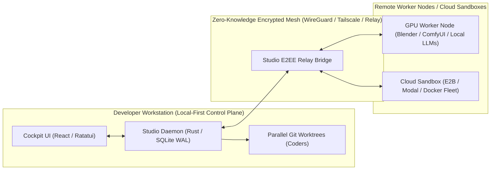
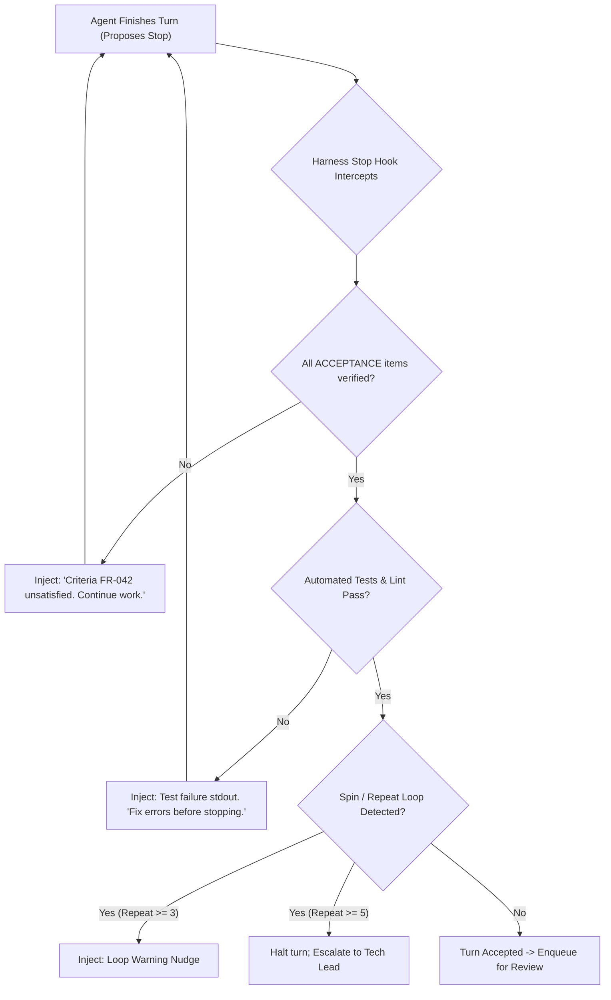
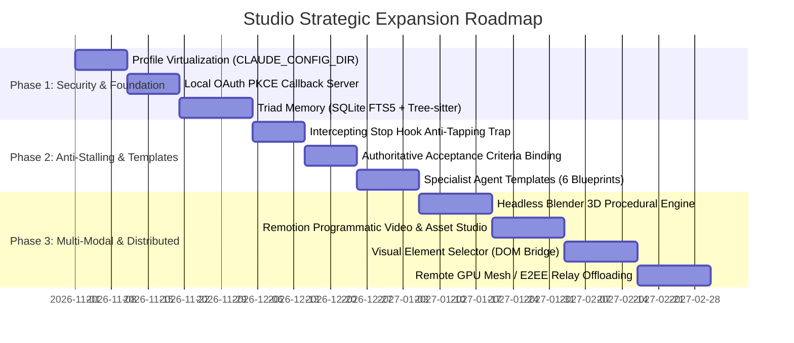

# Studio: Strategic Expansion & Advanced Systems Architecture
## Comprehensive Research Report & Technical Specification

> **File Location**: `/home/john/Projects/STC/plans/antigravity/STUDIO_STRATEGIC_EXPANSION_REPORT.md`  
> **Status**: Approved Architectural Extension Report  
> **Target Subsystems**: Multi-Modal Pipelines (3D/Video), Distributed Topology, Long-Term Memory (Vector vs AST vs FTS5), Anti-Stalling & Anti-Tapping Engines, Modular Agent Templates, Multi-Profile OAuth Virtualization  
> **Date**: September 2026

---

## Table of Contents
1. [Executive Problem Analysis](#1-executive-problem-analysis)
2. [Community Landscape & State-of-the-Art Review](#2-community-landscape--state-of-the-art-review)
3. [Complex Multi-Modal Workflows (3D, Video, Image, Desktop & Web UI)](#3-complex-multi-modal-workflows-3d-video-image-desktop--web-ui)
4. [Distributed Architecture & Hybrid Compute Topology](#4-distributed-architecture--hybrid-compute-topology)
5. [Data Organization & Memory Architecture: Vector DBs vs Structural Triad](#5-data-organization--memory-architecture-vector-dbs-vs-structural-triad)
6. [Human Feedback, UI/UX Interaction & Review Workflows](#6-human-feedback-uiux-interaction--review-workflows)
7. [Anti-Stalling & Anti-Tapping-Out Guarantees](#7-anti-stalling--anti-tapping-out-guarantees)
8. [Free Models & Modular Agent Templates](#8-free-models--modular-agent-templates)
9. [Authentication, Multi-Profile Isolation & OAuth Management](#9-authentication-multi-profile-isolation--oauth-management)
10. [Phased Execution Roadmap & Technical Deliverables](#10-phased-execution-roadmap--technical-deliverables)

---

# 1. Executive Problem Analysis

As AI engineering platforms transition from experimental CLI assistants to autonomous multi-agent production software agencies, eight critical technical challenges emerge:

1. **Ecosystem Sentiment & Competitive Deficits**: Current tools provide isolated CLI parallelism, but suffer from catastrophic merge conflicts, context bloat, and fragile orchestration scripts.
2. **Multi-Modal Asset Creation**: Modern engineering requires non-text assets: 3D models for games/WebGL, programmatic videos for marketing/documentation, and interactive web/desktop UI testing.
3. **Hybrid Compute Topology**: Heavy jobs (3D rendering, video synthesis, diffusion models, large test suites) cannot run efficiently on a developer's local laptop without distributed offloading.
4. **Long-Term Memory Precision**: Vector databases fail at codebase scale due to embedding drift, lack of call-graph hierarchy, and semantic fuzziness.
5. **Visual Human Feedback**: Feedback cannot be confined to text chat; operators must be able to visually select UI elements, review side-by-side diffs, and approve verification receipts.
6. **The "Tapping Out" Syndrome**: LLMs frequently abandon tasks halfway through, declaring false victory or suggesting that the human perform the implementation or testing.
7. **Model Cost Optimization**: Leveraging commodity free-tier models for scouting while reserving frontier models for reasoning and auditing.
8. **Multi-Profile Isolation**: Enabling developers to run multiple concurrent Claude Code, Codex, and OpenCode instances across different organizations without credential collisions.

---

# 2. Community Landscape & State-of-the-Art Review

A comprehensive audit of developer feedback across 60+ open-source agent orchestrators reveals distinct patterns of satisfaction and frustration:

```
┌────────────────────────────────────────────────────────┬────────────────────────────────────────────────────────┐
│ WHAT DEVELOPERS PRAISE IN EXISTING SOLUTIONS           │ WHAT DEVELOPERS CRITICIZE & FIND MISSING               │
├────────────────────────────────────────────────────────┼────────────────────────────────────────────────────────┤
│ • Parallel Worktree Isolation (Orca, Paseo):           │ • "Tapping Out" / Incomplete Work: Agents outlining    │
│   Running 4-8 tasks concurrently without blocking the  │   steps and asking the user to finish them.            │
│   primary working copy.                                │ • Merge Hell & Index Contention: Concurrent merges     │
│ • Local-First Execution: Keeping source code and       │   corrupting .git/index.lock or creating conflicts.    │
│   credentials on local machines.                       │ • Context Bloat & Cost Runaways: Registering 40+ MCP   │
│ • Integrated Diffs: Reviewing code changes visually    │   tools burning 10,000+ tokens per turn in schemas.    │
│   before staging commits.                              │ • Headless Deadlocks: Background agents hanging        │
│ • Terminal PTY Passthrough: Interactive CLI feel with  │   indefinitely on unhandled permission prompts.        │
│   native ANSI color rendering.                         │ • Text-Only Blindness: Inability to see rendered UI,   │
│ • Detached Sessions: Tasks persisting across reboot.   │   inspect CSS layout, or generate digital assets.      │
└────────────────────────────────────────────────────────┴────────────────────────────────────────────────────────┘
```

**Studio's Strategic Edge**: Studio bridges the gap between raw CLI tools (which lack multi-agent planning) and academic multi-agent frameworks (which produce toy conversational scripts rather than production git commits).

---

# 3. Complex Multi-Modal Workflows (3D, Video, Image, Desktop & Web UI)

Engineering platforms must orchestrate pipelines spanning 3D assets, programmatic motion graphics, and live application interaction.

```
                               ┌─────────────────────────────────────────────────┐
                               │           Studio Multi-Modal Gateway            │
                               └────────┬────────────────┬─────────────────┬─────┘
                                        │                │                 │
             ┌──────────────────────────┘                │                 └──────────────────────────┐
             ▼                                           ▼                                            ▼
┌─────────────────────────┐                 ┌─────────────────────────┐                  ┌─────────────────────────┐
│     3D Model Engine     │                 │   Programmatic Video    │                  │  UI / Browser Control   │
│  (Headless Blender /    │                 │    (Remotion / FFmpeg / │                  │  (Playwright / CDP /    │
│   glTF / Three.js)      │                 │    Flux Image API)      │                  │   OS Accessibility Tree)│
└────────────┬────────────┘                 └────────────┬────────────┘                  └────────────┬────────────┘
             │                                           │                                            │
             ▼                                           ▼                                            ▼
  Procedural Python/OpenSCAD                 React Timeline TSX / MP4                      DOM Element Selector /
  Headless glTF Export                       Validated Compositions                        Vision Screenshot Inspection
```

### 3.1 Headless 3D Asset Pipeline (Blender & Procedural glTF)
1. **Procedural Python Generation**: Large language models demonstrate high proficiency in writing Python scripts utilizing Blender's `bpy` API, procedural OpenSCAD, and declarative Three.js JSON.
2. **Headless Execution**: Studio executes:
   ```bash
   blender --background --python generate_mesh.py -- --output model.glb --render-preview preview.png
   ```
3. **Iterative Vision Verification**: The rendered `preview.png` is returned to the agent's multi-modal context window. If geometry or lighting requires adjustment, the agent refines the script. The `.glb` asset is validated using `@gltf-transform/core`.

### 3.2 Programmatic Video & Image Generation (The Remotion Pattern)
1. **Video as Code**: Following `iPolloWork` (`packages/video-studio`) and `munder-difflin` (`landing-remotion/`), video compositions are defined in React TSX using **Remotion**.
2. **Deterministic Rendering**: The agent defines keyframe animations, audio timing, and layout in code. Studio compiles and renders the video via `@remotion/renderer` to produce broadcast-quality MP4/WebM videos in headless CI.
3. **Generative Imagery**: Studio routes asset requests (textures, icons, marketing banners) through an MCP proxy to local ComfyUI GPU nodes or cloud image endpoints (Fal.ai, Flux).

### 3.3 Application Interaction (Web & Desktop)
- **Web Applications**: Controlled via Chrome DevTools Protocol (CDP) and Playwright. Adopting `iPolloWork`'s `design-studio` bridge: clicking any element in the live preview extracts its CSS locator, computed styles, and file path, injecting a scoped prompt into the agent.
- **Desktop Applications**: Controlled via OS Accessibility Trees (AT-SPI on Linux, UIAutomation on Windows, Accessibility API on macOS) paired with Anthropic Computer Use API for coordinate-based mouse and keyboard interaction.

---

# 4. Distributed Architecture & Hybrid Compute Topology

Studio implements a **Tiered Distributed Execution Model**:



1. **Tier 1: Local Control Plane**:
   - The master daemon, Task DAG coordinator, SQLite WAL database, and Git worktrees run locally on the developer workstation.
   - Code never leaves the local disk without explicit user authorization.
2. **Tier 2: Remote GPU Workers**:
   - Heavy compute tasks (Blender raytracing, local video rendering, ComfyUI diffusion, or local DeepSeek-R1 inference) are dispatched to remote GPU nodes over an encrypted WireGuard mesh or Studio's E2EE relay.
3. **Tier 3: Ephemeral Cloud Sandboxes (E2B / Modal / Docker)**:
   - Untrusted code execution, heavy dependency building, and parallel regression suites run in isolated, disposable cloud VMs with sub-second spin-up times.

---

# 5. Data Organization & Memory Architecture: Vector DBs vs. Structural Triad

### 5.1 Critique of Vector Databases for Codebases
Heavyweight vector databases (Pinecone, Chroma, Qdrant) present severe limitations in software engineering platforms:
- **Lack of Exact Precision**: Embeddings fail to distinguish between syntactically distinct but semantically adjacent symbols (e.g. `updateUser` vs `deleteUser`).
- **Index Drift**: In fast-moving multi-agent environments with parallel git worktrees, embedding indexes become stale within minutes, incurring massive re-indexing overhead.
- **No Topological Hierarchy**: Cosine similarity returns isolated chunks without call-graph provenance or import relationships.

### 5.2 Studio's Structural Memory Triad
Studio replaces monolithic vector search with a **Triad Memory Architecture**:

```
┌────────────────────────────────────────────────────────────────────────────────────────┐
│                             Studio Triad Memory Architecture                           │
├────────────────────────────┬────────────────────────────┬──────────────────────────────┤
│ 1. AST Structural Graph    │ 2. Deterministic FTS5 Lex  │ 3. Snapcompact Vision Memory │
├────────────────────────────┼────────────────────────────┼──────────────────────────────┤
│ • Tree-sitter symbol graph │ • SQLite FTS5 (BM25)       │ • Bitmap rasterization       │
│ • Callers, callees, routes │ • Exact token & regex match│ • Discarded turns -> PNG     │
│ • Impact cone / blast rad  │ • Ranked keyword recall    │ • Vision models read history │
│ • Zero drift; branch-aware │ • Sub-millisecond latency  │ • Fixed image token billing  │
└────────────────────────────┴────────────────────────────┴──────────────────────────────┘
```

1. **AST Structural Graph (`repo-graph`)**:
   - Parses codebases via Tree-sitter across 13+ languages into a local directed graph.
   - Computes callers, callees, transitive blast radius, and symbol impact cones on demand with zero latency.
2. **Deterministic Full-Text Search (SQLite FTS5)**:
   - Embedded directly in `studio.db`. Provides BM25-ranked lexical and regex search across project notes, decision records, and API signatures.
3. **Snapcompact Vision Compression (from `oh-my-pi`)**:
   - Serializes expired conversation turns into dense 8x13 pixel-font PNG frames.
   - Vision-capable foundation models read historical context as image inputs at fixed image token rates, bypassing expensive text token accumulation.

### 5.3 Dedicated Data Agents: Scout vs. Librarian
- **Codebase Scout / Explorer Agent**: Runs during task preparation. Queries the AST graph and FTS5 index to construct a bounded, token-budgeted `context_pack` (<2,000 tokens) containing only the exact symbol definitions and call sites needed for the task.
- **Knowledge Librarian / Curator Agent**: Runs asynchronously after task completion. Analyzes execution traces, extracts successful problem-solving procedures (SOPs), updates project `memory.md`, and prunes deprecated notes.

---

# 6. Human Feedback, UI/UX Interaction & Review Workflows

1. **Visual Element Selection (The iPolloWork Bridge)**:
   - Operators can click any element in the live web preview.
   - Studio extracts the DOM element's tag, text, CSS locator, computed styles, and source file path, generating an authoritative prompt:
     ```
     Edit element <button id="submit-btn"> in src/components/Form.tsx (locator: #submit-btn).
     Computed styles: { background: "#38bdf8", padding: "8px 16px" }.
     Change: Make background color follow --studio-primary token.
     ```
2. **Side-by-Side Diff Review & Inline Critiques**:
   - The Cockpit embeds Monaco-based diff views. Operators click on specific lines of diffs to leave inline review comments.
   - Comments are dispatched directly into the Coder agent's active worktree inbox, forcing a remediation cycle.
3. **Automated Verification Receipts**:
   - Tasks cannot be merged without signed verification receipts covering linter checks, test regression suites, and security scans.

---

# 7. Anti-Stalling & Anti-Tapping-Out Guarantees

LLM agents frequently "tap out" by completing partial work and suggesting that the user perform manual testing or implementation. Studio enforces completion through a **Tri-Layer Anti-Stalling Engine**:



1. **The Intercepting Stop Hook Trap (from `munder-difflin`)**:
   - When an agent CLI indicates completion, the harness `Stop` lifecycle hook intercepts the process.
   - If acceptance criteria remain unverified or unit tests have not executed, the hook returns `{"decision": "block", "reason": "Task requirements incomplete. Tests not executed."}`.
2. **Authoritative Acceptance Criteria Binding (from `opencode-swarm`)**:
   - Every task includes an immutable acceptance specification (`ACCEPTANCE: [FR-###]`).
   - The coder is bound by contract: work is not complete until every acceptance criterion is verified.
3. **Two-Tier Loop Guards & Progress Governors (from `Orkas`)**:
   - Hashing tool signatures (`tool\0args`) detects repetitive calls, nudging the agent at round 3 and halting execution at round 5.
   - The progress governor classifies tool rounds into discovery vs productive edits, terminating unassisted exploration loops.

---

# 8. Free Models & Modular Agent Templates

### 8.1 Multi-Tier Model Routing
Studio reduces operational API costs by routing tasks across model tiers:
- **Commodity / Free Tier (OpenCode Zen / Groq / Gemini Flash / DeepSeek V3)**:
  - Codebase exploration, dependency analysis, log parsing, documentation drafting.
- **Frontier Reasoning Tier (Claude 3.7 Sonnet, GPT-4o, DeepSeek R1)**:
  - Architecture negotiation, task decomposition, complex algorithm implementation, security review.

### 8.2 Six Prebuilt Specialist Agent Blueprints
Studio ships with declarative agent templates:
1. **`FullStackEngineer`**: Scoped worktree filesystem, LSP, sandboxed bash, test runners.
2. **`CodebaseArchaeologist`**: Read-only AST, FTS5 lexical search, call-graph tracing.
3. **`SecurityAuditor`**: Static analysis (`oxlint`, `clippy`), secret scanning, AST blast radius inspection.
4. **`VisualUIDesigner`**: DOM element inspection, `design-tokens.css` management, CDP headless browser screenshot capture.
5. **`Asset3DStudio`**: Headless Blender Python scripting, procedural OpenSCAD, glTF validation.
6. **`MotionVideoProducer`**: Remotion React TSX timeline construction, FFmpeg assembly.

---

# 9. Authentication, Multi-Profile Isolation & OAuth Management

### 9.1 Multi-Profile Environment Isolation
Developers often juggle personal and corporate accounts. Studio isolates profiles using undocumented environment overrides discovered during forensic auditing:

```
┌────────────────────────────────────────────────────────────────────────────────────────┐
│                              Studio Profile Virtualization                             │
├────────────────────┬─────────────────────────────┬─────────────────────────────────────┤
│ Agent Engine       │ Isolation Variable          │ Virtualized Sandbox Path            │
├────────────────────┼─────────────────────────────┼─────────────────────────────────────┤
│ **Claude Code**    │ `CLAUDE_CONFIG_DIR`         │ `~/.studio/auth/profiles/claude-work/` │
│ **OpenAI Codex**   │ `CODEX_HOME`                │ `~/.studio/auth/profiles/codex-team/` │
│ **OpenCode**       │ `OPENCODE_CONFIG_DIR`       │ `~/.studio/auth/profiles/opencode-dev/`│
│ **Pi / OMP**       │ `PI_CONFIG_DIR`             │ `~/.studio/auth/profiles/pi-custom/`  │
│ **Antigravity**    │ `ANTIGRAVITY_HOME`          │ `~/.studio/auth/profiles/agy-main/`   │
└────────────────────┴─────────────────────────────┴─────────────────────────────────────┘
```

Studio dynamically injects the appropriate configuration directory when launching child agent processes. Multiple Claude Code or Codex instances run concurrently under distinct credentials without token clobbering.

### 9.2 Local OAuth PKCE Callback Server
For OAuth providers (GitHub, Anthropic, Google Cloud):
1. The daemon starts an ephemeral localhost listener: `http://127.0.0.1:58231/oauth/callback`.
2. Initiates the OAuth PKCE flow in the user's default browser.
3. Receives authorization codes, exchanges them for access/refresh tokens, and encrypts credentials into the OS Keyring.
4. Manages automatic token refresh cycles before credential expiration (`expiresAt`).

---

# 10. Phased Execution Roadmap & Technical Deliverables



### Key Deliverables:
- **`studio-core/src/auth/virtualization.rs`**: Profile virtualization and `CLAUDE_CONFIG_DIR` mounting.
- **`studio-core/src/auth/oauth.rs`**: Local OAuth PKCE callback listener and OS Keyring integration.
- **`studio-core/src/memory/triad.rs`**: AST Graph + SQLite FTS5 + Snapcompact vision pipeline.
- **`studio-core/src/engine/anti_stalling.rs`**: Stop hook trap, acceptance criteria binding, and loop guards.
- **`studio-core/src/multimodal/`**: Blender 3D, Remotion video, and Playwright DOM selector modules.
- **`templates/agents/`**: Declarative TOML blueprints for 6 specialized agent personas.

---

*Authored for the STC Engineering Initiative.*
